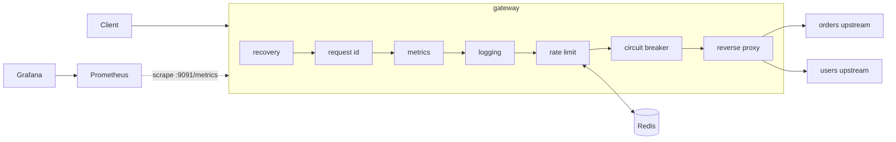
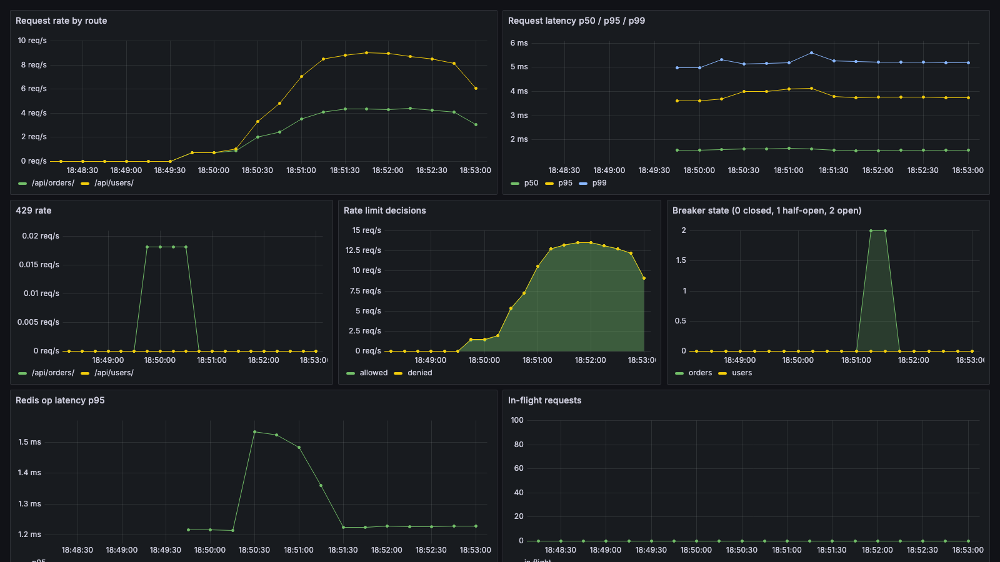

# gateway

A reverse proxy and API gateway in Go with three headline features: Redis-backed token bucket rate limiting made atomic with a Lua script, a hand-rolled per-upstream circuit breaker, and full Prometheus/Grafana observability. Built stdlib-first: routing is `net/http` with Go 1.22 ServeMux patterns, proxying is `httputil.ReverseProxy`, and the only runtime dependencies are the Redis client, the Prometheus client and a YAML parser. Everything runs locally with one `docker compose up`.

## Architecture



Each route in `config.yaml` maps a path prefix to an upstream with its own rate limit; each upstream gets its own timeout and circuit breaker.

## Design decisions

**Stdlib over gin or echo.** A gateway is mostly `net/http` plumbing: handlers, middleware, a reverse proxy. Go 1.22 ServeMux covers the routing, so a framework would add a dependency without removing any code. It also keeps every middleware an ordinary `func(http.Handler) http.Handler`.

**Lua/EVALSHA instead of GET then SET.** The token bucket refill and consume must be one atomic step. With separate commands, two concurrent requests can both read "1 token left" and both spend it; under load a burst-10 bucket admits far more than 10. Redis runs a Lua script as a single uninterruptible unit. The integration test that fires 100 goroutines at one bucket with burst 10 and asserts exactly 10 allowed fails without the script and passes with it.

**Fail open when Redis is down.** Rate limit checks have a 50ms budget; on error or timeout the request is allowed, logged, and counted in a `failopen` metric. The alternative, failing closed, turns a Redis outage into a full gateway outage. For plain routing, availability wins. For quota billing or auth throttling the opposite default would be right, and the decision is one branch in the middleware.

**Only 5xx and transport errors trip the breaker.** A 404 or 422 means the client sent a bad request to a healthy upstream. Counting those as failures would let one misbehaving client open the breaker and cut off everyone else.

**Mutex over lock-free.** The breaker's critical section is a few comparisons and a ring buffer write, no I/O and no allocation. At gateway request rates the lock is never contended long enough to matter, and a CAS-based version invites subtle ordering bugs for no measurable win.

## Quickstart

```sh
make docker-up
```

A proxied request, with rate limit headers:

```sh
curl -i http://localhost:8080/api/orders/
```

Trigger a 429 by exhausting the burst (orders allows 5 rps with burst 10):

```sh
for i in $(seq 1 14); do curl -s -o /dev/null -w "%{http_code} " http://localhost:8080/api/orders/; done
```

Watch the circuit breaker open after the orders upstream is killed, then short-circuit with 503s:

```sh
make demo-breaker
```

Grafana is at http://localhost:3000 (anonymous access, dashboard "API Gateway"), Prometheus at http://localhost:9090.



## Performance

Local numbers from `make loadtest` (k6 against the docker compose stack on an M-series MacBook, so a smoke test of behavior under load, not a benchmark claim):

| Scenario | Throughput | Outcome | p50 | p95 |
|---|---|---|---|---|
| Steady 8 rps, under the 10 rps limit | 8.0 req/s | 241 of 241 got 200 | 6.1 ms | 11.3 ms |
| 20 VUs hammering a 5 rps route for 15s | 13,739 req/s | 206,020 got 429, 84 got 200 | 1.3 ms (429) | 2.3 ms (429) |
| Upstream killed, 4 rps for 30s | 4.0 req/s | 5 got 502, then 116 got 503 | 4.5 ms (503) | 8.7 ms (503) |

Three things worth noting. The 200s during the burst came through at 5.6/s, which is the 5 token/s refill rate doing its job. A 429 costs about 1.3 ms at the median, which is the full limiter path including the Redis round trip, so that is roughly what the rate limiter adds to p95 on an allowed request too. And once the breaker opened, a failed request went from 10.5 ms (attempting the dead upstream) to 4.5 ms (short-circuit), while the upstream stopped receiving traffic entirely after the first 5 failures.

## Tests

```sh
make test-unit   # unit tests only (-short)
make test        # everything; integration tests need Docker for testcontainers
```

Unit tests cover config validation, middleware behavior with fakes, and the breaker state machine against an injected fake clock, so no test sleeps. Integration tests run against a real Redis via testcontainers-go and prove the properties that matter: a burst of N allows exactly N, tokens refill at the configured rate, buckets are per-client, and 100 concurrent requests against burst 10 get exactly 10 through, which is the atomicity guarantee the Lua script exists for. `go test -race` passes, including a test that hammers the breaker through state transitions concurrently.

## Configuration

`config.yaml` defines the listen addresses, upstreams (with per-upstream timeouts) and routes (with per-route rate limits). `GATEWAY_LISTEN` and `GATEWAY_REDIS_URL` override the file for deployment. Invalid config fails at startup with every problem listed, not just the first.
